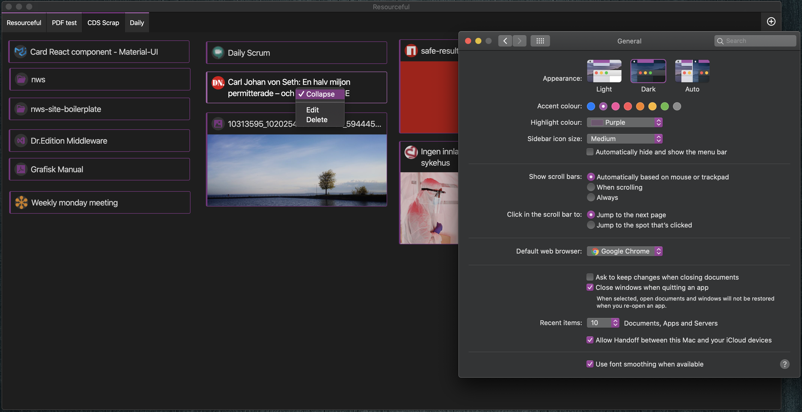
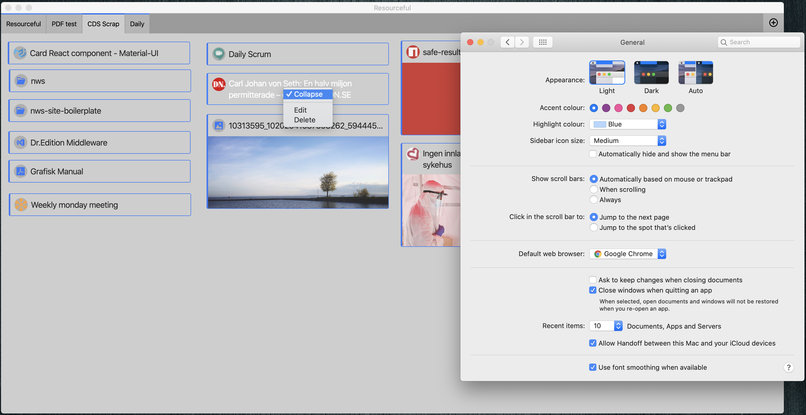

# Resourceful

_(Duly note that this project is still heavily a WIP)_

**Resourceful** is an Electron app which intention is to make it easy to store
resources, or links to resources, in project form. When you work in projects,
especially as a software developer, you usually need to keep track of various
documents, links to project resources like online meeting groups,
specifications, time tracking services, code editor project files and so on.

It can be a cognitive load to keep all these things in order. And this is where
**Resourceful** is ment to fill some space.

Create a project in **Resourceful**, copy and past urls straight in the app,
drag and drop PDF, image, and pretty much any other file or directoy onto the
app and you will have easy access to all your project files.

_Dark mode (with system accent color)_


_Light mode (with system accent color)_


---

## Feature todo

- Better themeing based on system preferences.
  At the moment there's no themeing of any Material UI widgets

- Ordering of project tabs

- Save and reuse app window size and position

- Edit forms for projects and resources

- Support for snippet resources

- Ordering/placement of resources

- Project workspace zoom

- App settings

- ...and the list will go on

---

## Running

At the moment there are no binary builds so the app needs to be run from source.

`cd` into `packages/resourceful-app` and run

```
# Installs all NPM packges
yarn

# Builds the app
yarn build

# Starts the app
yarn start
```
